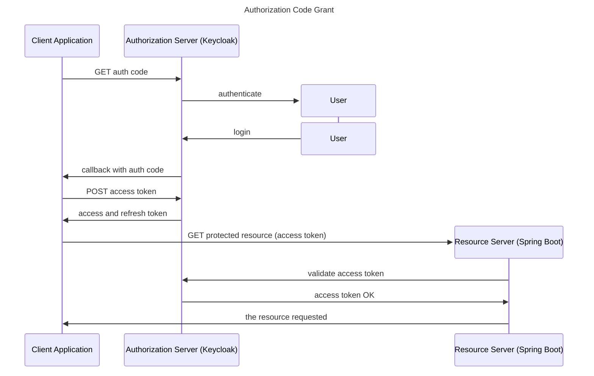

<h1>OAuth 2.0 in Spring Boot Applications</h1>

<!-- TOC -->
  * [Info](#info)
  * [Examples](#examples)
  * [OAuth2: Grant Type](#oauth2--grant-type)
  * [Keycloak Notes](#keycloak-notes)
  * [Authorization flow on Postman](#authorization-flow-on-postman)
    * [Flow 1: GET and POST](#flow-1--get-and-post)
    * [Flow 2: using Authorization tool](#flow-2--using-authorization-tool)
  * [Create Resource Server](#create-resource-server)
  * [Resource Server: scope based](#resource-server--scope-based)
  * [Role based access control with Keycloak](#role-based-access-control-with-keycloak)
  * [Resource Server: method level security](#resource-server--method-level-security)
    * [Secure method](#secure-method)
    * [PreAuthorize](#preauthorize)
    * [PostAuthorize](#postauthorize)
  * [Spring Boot Api Gateway](#spring-boot-api-gateway)
  * [Spring Boot Eureka server](#spring-boot-eureka-server)
  * [Spring Boot Eureka client](#spring-boot-eureka-client)
<!-- TOC -->

---

## Info
* Udemy course:  
https://www.udemy.com/course/oauth2-in-spring-boot-applications  

* Instructor Sergey Kargopolov:  
https://www.linkedin.com/in/kargopolov/

## Examples
* [01_SpringBootResourceServer](https://github.com/AntonioDiaz/udemy-oauth2-spring/tree/master/01_SpringBootResouceServer)  
* [02_SpringBootApiGateway](https://github.com/AntonioDiaz/udemy-oauth2-spring/tree/master/02_SpringBootApiGateway)
* [03_SpringBootEurekaServer](https://github.com/AntonioDiaz/udemy-oauth2-spring/tree/master/03_SpringBootEurekaServer)


## OAuth2: Grant Type
1. Authorization code
2. PKCE enhanced
3. Client Credentials
4. Device Code 
5. Implicit flow
6. Password grant



## Keycloak Notes
Start Keycloak:
```shell
docker run \
    -p 8080:8080 \
    -e KC_BOOTSTRAP_ADMIN_USERNAME=admin \
    -e KC_BOOTSTRAP_ADMIN_PASSWORD=admin \
    quay.io/keycloak/keycloak:26.2.0 \
    start-dev
```
* Create a realm: `my_realm`
* Useful URLs
  * well-known: http://localhost:8080/realms/my-realm/.well-known/openid-configuration
  * user account: http://localhost:8080/realms/my-realm/account
  * authorization_endpoint: http://localhost:8080/realms/my-realm/protocol/openid-connect/auth
  * token_endpoint: http://localhost:8080/realms/my-realm/protocol/openid-connect/token
  * user_info: http://localhost:8080/realms/my-realm/protocol/openid-connect/userinfo

* Create oauth client
  * On "Capability config", "Client authentication" must be activated.
  * On tab "Credentials" you can set the `Client secret`.  
  


* Create user, select the new realm  |   


## Authorization flow on Postman
### Flow 1: GET and POST
* Get auth token  


* Get Access token  


* Request protected resource


### Flow 2: using Authorization tool
* Update client to add `https://oauth.pstmn.io/v1/callback` as valid redirect URI on Keycloak
* Set up postman to manage the flow to get the access token  


## Create Resource Server 
* Create Spring Boot project: https://start.spring.io/

* Add 3 dependencies:
  * Spring Web
  * Devtools
  * Oauth2 Resource Server

* Create Rest controller
````java
import org.springframework.security.core.annotation.AuthenticationPrincipal;
import org.springframework.security.oauth2.jwt.Jwt;
import org.springframework.web.bind.annotation.GetMapping;
import org.springframework.web.bind.annotation.RequestMapping;
import org.springframework.web.bind.annotation.RestController;
@RestController
@RequestMapping("/users")
public class MyController {

  @GetMapping("/status")
  public String checkStatus() {
    return "OK";
  }

  @GetMapping("/token")
  public String showToken(@AuthenticationPrincipal Jwt jwt){
    System.out.println("JWT -> " + jwt.getClaims());
    final StringBuilder response = new StringBuilder();
    jwt.getClaims().forEach((k, v)-> { response.append(k + "->" + v + "\n");} );
    return response.toString();
  }
}
````

* Add properties with the issuer to validate the access token:
````properties
spring.security.oauth2.resourceserver.jwt.issuer-uri=\
  http://localhost:8080/realms/my-realm

spring.security.oauth2.resourceserver.jwt.jwt-set-uri=\
  http://localhost:8080/realms/my-realm/protocol/openid-connect/certs
````

## Resource Server: scope based
* Scope based is a mechanism on Oauth2 to limit client application access to users account.

* `scope` is a Query Param sent on the auth request, so user need to authorize the client application to access that scope.  

* Scopes is a list of words separate with spaces.

* Adding security configuration
````java
import org.springframework.context.annotation.Bean;
import org.springframework.http.HttpMethod;
import org.springframework.security.config.annotation.web.builders.HttpSecurity;
import org.springframework.security.config.annotation.web.configuration.EnableWebSecurity;
import org.springframework.security.web.SecurityFilterChain;
import org.springframework.stereotype.Component;

@EnableWebSecurity
@Component
public class WebSecurity {

  @Bean
  SecurityFilterChain configure(HttpSecurity http) throws Exception {
    http
            .authorizeHttpRequests(oauthz -> oauthz
                    .requestMatchers(HttpMethod.GET, "/users/status").hasAnyAuthority("SCOPE_email")
                    .anyRequest().authenticated())
            .oauth2ResourceServer(oauth2 -> oauth2.jwt(jwtConfigurer -> {}));
    return http.build();
  }
}
````

## Role based access control with Keycloak
* Create User Role  

* Assign role to the user  

* Convert JWT role list into Spring role list, we need to add `ROLE_` as prefix to every role received on the JWT.
```java
public class KeycloakRoleConverter implements Converter<Jwt, Collection<GrantedAuthority>> {

  @Override
  public Collection<GrantedAuthority> convert(Jwt jwt) {
    Map<String, Object> realmAccess = (Map<String, Object>) jwt.getClaims().get("realm_access");
    if (realmAccess == null || realmAccess.isEmpty()) {
      return new ArrayList<>();
    }
    Collection<GrantedAuthority> returnValue = ((List<String>) realmAccess.get("roles"))
        .stream().map(roleName -> "ROLE_" + roleName)
        .map(SimpleGrantedAuthority::new)
        .collect(Collectors.toList());
    return returnValue;
  }
}
```

* Spring code for role validation:
Note: `.hasRole("developer")` is same as `.hasAuthority("ROLE_developer")`
````java
@Bean
SecurityFilterChain configure(HttpSecurity http) throws Exception {
  JwtAuthenticationConverter jwtAuthenticationConverter = new JwtAuthenticationConverter();
  jwtAuthenticationConverter.setJwtGrantedAuthoritiesConverter(new KeycloakRoleConverter());
  http
    .authorizeHttpRequests(oauthz -> oauthz
        .requestMatchers(HttpMethod.GET, "/users/status").hasAnyAuthority("SCOPE_email")
        .requestMatchers(HttpMethod.GET,"/users/token").hasRole("developer")
        .anyRequest().authenticated())
    .oauth2ResourceServer(oauth2 -> oauth2.jwt(jwt -> jwt.jwtAuthenticationConverter(jwtAuthenticationConverter)));
  return http.build();
}
````

## Resource Server: method level security
https://docs.spring.io/spring-security/reference/servlet/authorization/method-security.html#page-title

* Annotations:
@Secured
@PreAuthorize
@PostAuthorize

### Secure method
* Enable method security
`@EnableMethodSecurity(securedEnabled=true)`

* Using **Secure** annotation
````java
@Secured("ROLE_admin")
@GetMapping("/delete")
public String delete() {
  return "DELETE";
}
````
### PreAuthorize
* Enable **PreAuthorize** method security
  `@EnableMethodSecurity(prePostEnabled=true)`

* Adding validation
````java
@GetMapping(path = "/delete/{id}")
@PreAuthorize("hasAuthority('ROLE_admin') and #id == #jwt.subject")
public String deletePre(@PathVariable String id, @AuthenticationPrincipal Jwt jwt) {
  return String.format("will delete %s  for user %s", id, jwt.getSubject());
}
````

### PostAuthorize
Executes the method and check the security, only returns the value if expression evaluates to true.
````java
@GetMapping(path = "/{id}")
@PostAuthorize("returnObject.id == '1234'")
public User getUser(@PathVariable String id) {
  log.info("***Getting user {}", id);
  return new User(id, "Antoine");
}
````

##  Spring Boot Api Gateway
Example of a resource server behind a Api Gateway.
````mermaid
---
config:
      theme: redux
---
flowchart LR
        A("User 🙋")
        B("Client Application")
        C("Identity Provider <br> Keycload")
        D("API Gateway")
        E("Microservice <br> /photos port - 8081")
        F("Microservice <br> /comments port - 8082")
        A --> B
        B --"(1) get access token"--> C
        C --(2) return access token--> B
        B --(3) request--> D
        D --(4) request--> E
        D --> F
````

Maven dependencies:
1. spring-cloud-starter-gateway
2. spring-boot-starter-actuator

Properties:
````properties
spring.cloud.gateway.routes[0].id = user-status-check
spring.cloud.gateway.routes[0].uri = http://localhost:8081
spring.cloud.gateway.routes[0].predicates[0] = Path=/users/token
spring.cloud.gateway.routes[0].predicates[1] = Method=GET
spring.cloud.gateway.routes[0].filters[0] = RemoveRequestHeader=Cookie
````

## Spring Boot Eureka server
* Create new project, https://start.spring.io
  * Add dependencies:
    * Eureka discovery client
    * Eureka Server
* Add annotation `@EnableEurekaServer` to the spring boot application.
* Add properties: application.properties
````properties
server.port=8090
eureka.client.registerWithEureka=false
eureka.client.fetchRegistry=false
logging.level.com.netflix.eureka=OFF
logging.level.com.netflix.discovery=OFF
````

* Add properties: bootstrap.properties
````properties
spring.application.name=discovery-service
````


## Spring Boot Eureka client
* On Project 01_SpringBootResourceServer
* Add Spring Cloud dependencies:
```xml
<dependencyManagement>
    <dependencies>
      <dependency>
        <groupId>org.springframework.cloud</groupId>
        <artifactId>spring-cloud-dependencies</artifactId>
        <version>${spring-cloud.version}</version>
        <type>pom</type>
        <scope>import</scope>
      </dependency>
    </dependencies>
</dependencyManagement>
```
* Add dependence to pom:
````xml
<dependency>
  <groupId>org.springframework.cloud</groupId>
  <artifactId>spring-cloud-starter-netflix-eureka-client</artifactId>
</dependency>
````

* Add annotation `@EnableDiscoveryClient`

* Service registered on Eureka server

