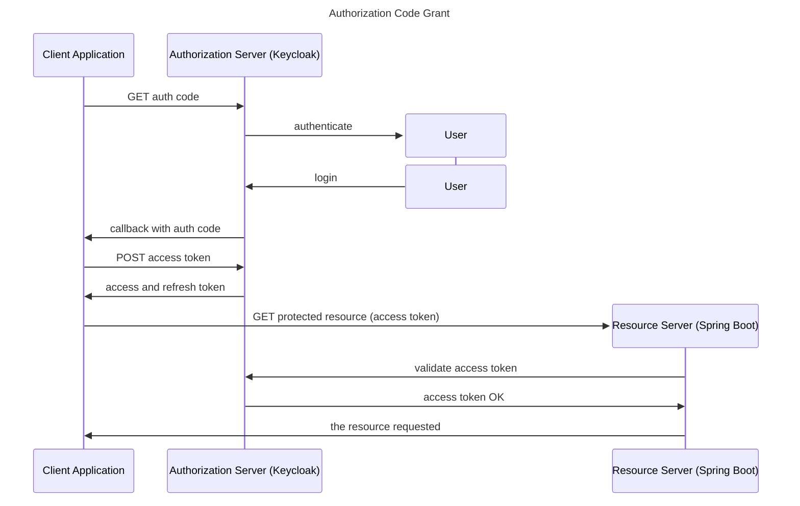

# POC of Resource Server using OAuth2 and Spring Boot

Practice for course:  
https://www.udemy.com/course/oauth2-in-spring-boot-applications

## OAuth Authorization code flow
Grant Type
1. Authorization code
2. PKCE enhanced
3. Client Credentials
4. Device Code 
5. Implicit flow
6. Password grant



## Keycloak Notes
Start Keycloak:
```shell
docker run \
    -p 8080:8080 \
    -e KC_BOOTSTRAP_ADMIN_USERNAME=admin \
    -e KC_BOOTSTRAP_ADMIN_PASSWORD=admin \
    quay.io/keycloak/keycloak:26.2.0 \
    start-dev
```
* Create client

* Create user
