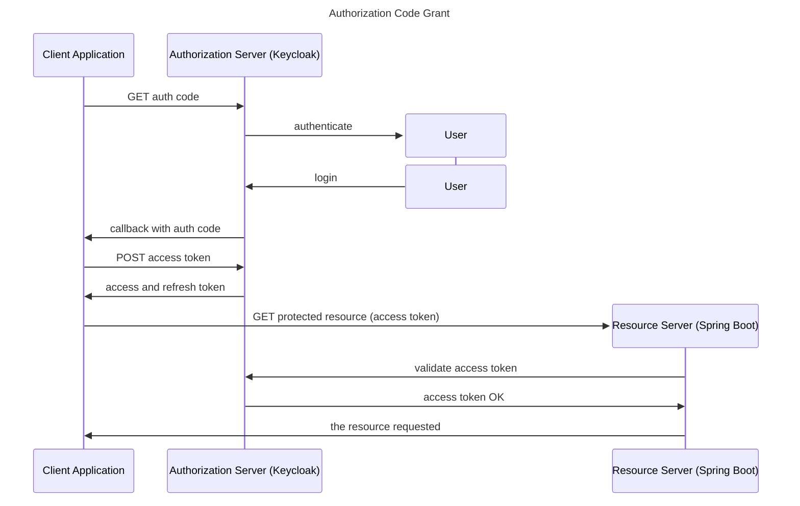

<h1>OAuth 2.0 in Spring Boot Applications</h1>

<!-- TOC -->
  * [Info](#info)
  * [OAuth2: Grant Type](#oauth2--grant-type)
  * [Keycloak Notes](#keycloak-notes)
  * [Authorization flow on Postman](#authorization-flow-on-postman)
    * [Flow 1: GET and POST](#flow-1--get-and-post)
    * [Flow 2: using Authorization tool](#flow-2--using-authorization-tool)
  * [Create Resource Server](#create-resource-server)
  * [Resource Server: scope based](#resource-server--scope-based)
<!-- TOC -->

---

## Info
* Udemy course:  
https://www.udemy.com/course/oauth2-in-spring-boot-applications  

* Instructor Sergey Kargopolov:  
https://www.linkedin.com/in/kargopolov/

## OAuth2: Grant Type
1. Authorization code
2. PKCE enhanced
3. Client Credentials
4. Device Code 
5. Implicit flow
6. Password grant



## Keycloak Notes
Start Keycloak:
```shell
docker run \
    -p 8080:8080 \
    -e KC_BOOTSTRAP_ADMIN_USERNAME=admin \
    -e KC_BOOTSTRAP_ADMIN_PASSWORD=admin \
    quay.io/keycloak/keycloak:26.2.0 \
    start-dev
```
* Create a realm: `my_realm`
* Useful URLs
  * well-known: http://localhost:8080/realms/my-realm/.well-known/openid-configuration
  * user account: http://localhost:8080/realms/my-realm/account
  * authorization_endpoint: http://localhost:8080/realms/my-realm/protocol/openid-connect/auth
  * token_endpoint: http://localhost:8080/realms/my-realm/protocol/openid-connect/token
  * user_info: http://localhost:8080/realms/my-realm/protocol/openid-connect/userinfo

* Create oauth client
  * On "Capability config", "Client authentication" must be activated.
  * On tab "Credentials" you can set the `Client secret`.  
  


* Create user, select the new realm  |   


## Authorization flow on Postman
### Flow 1: GET and POST
* Get auth token  


* Get Access token  


* Request protected resource


### Flow 2: using Authorization tool
* Update client to add `https://oauth.pstmn.io/v1/callback` as valid redirect URI on Keycloak
* Set up postman to manage the flow to get the access token  


## Create Resource Server 
* Create Spring Boot project: https://start.spring.io/

* Add 3 dependencies:
  * Spring Web
  * Devtools
  * Oauth2 Resource Server

* Create Rest controller
````java
import org.springframework.security.core.annotation.AuthenticationPrincipal;
import org.springframework.security.oauth2.jwt.Jwt;
import org.springframework.web.bind.annotation.GetMapping;
import org.springframework.web.bind.annotation.RequestMapping;
import org.springframework.web.bind.annotation.RestController;
@RestController
@RequestMapping("/users")
public class MyController {

  @GetMapping("/status")
  public String checkStatus() {
    return "OK";
  }

  @GetMapping("/token")
  public String showToken(@AuthenticationPrincipal Jwt jwt){
    System.out.println("JWT -> " + jwt.getClaims());
    final StringBuilder response = new StringBuilder();
    jwt.getClaims().forEach((k, v)-> { response.append(k + "->" + v + "\n");} );
    return response.toString();
  }
}
````

* Add properties with the issuer to validate the access token:
````properties
spring.security.oauth2.resourceserver.jwt.issuer-uri=\
  http://localhost:8080/realms/my-realm

spring.security.oauth2.resourceserver.jwt.jwt-set-uri=\
  http://localhost:8080/realms/my-realm/protocol/openid-connect/certs
````

## Resource Server: scope based
* Scope based is a mechanism on Oauth2 to limit client application access to users account.

* `scope` is a Query Param sent on the auth request, so user need to authorize the client application to access that scope.  

* Scopes is a list of words separate with spaces.

* Adding security configuration
````java
import org.springframework.context.annotation.Bean;
import org.springframework.security.config.annotation.web.builders.HttpSecurity;
import org.springframework.security.config.annotation.web.configuration.EnableWebSecurity;
import org.springframework.security.web.SecurityFilterChain;

@EnableWebSecurity
public class WebSecurity {

  @Bean
  SecurityFilterChain configure(HttpSecurity http) throws Exception {
    http
            .authorizeHttpRequests(oauthz -> oauthz.anyRequest().authenticated())
            .oauth2ResourceServer(oauth2 -> oauth2.jwt(jwtConfigurer -> {}));
    return http.build();
  }
}
````